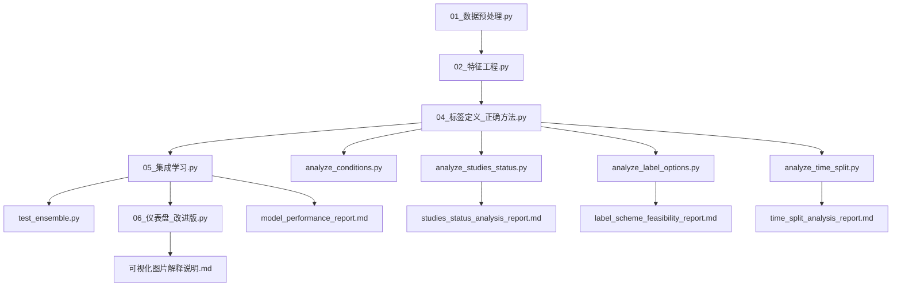

# 报告来源说明文档

## 📋 概述

本文档详细说明 `results/reports/` 目录下所有报告文件的生成来源和对应的分析程序。

## 📊 报告文件与生成程序对应关系

### 1. `label_scheme_feasibility_report.md` - 标签定义方案可行性报告

**生成程序**: `scripts/analysis/analyze_label_options.py`

**程序功能**:
- 分析标签定义方案的可行性
- 比较方案A（扩展安全性关键词）和方案B（剔除缺失数据）的效果
- 提供关键词优化建议

**报告内容**:
- 终止状态试验总数和填充率分析
- 当前关键词召回率评估
- 扩展关键词效果分析
- 方案对比和推荐建议

**运行命令**:
```bash
python scripts/analysis/analyze_label_options.py
```

---

### 2. `model_performance_report.md` - 模型性能报告

**生成程序**: `scripts/05_集成学习.py`

**程序功能**:
- 集成学习模型训练和评估
- 性能指标计算和报告生成
- 阈值优化和可解释性分析

**报告内容**:
- 数据集概览和样本分布
- 模型性能指标（AUC、召回率、精确率等）
- 阈值优化结果
- 特征重要性分析

**运行命令**:
```bash
python scripts/05_集成学习.py
```

---

### 3. `studies_status_analysis_report.md` - 试验状态分析报告

**生成程序**: `scripts/analysis/analyze_studies_status.py`

**程序功能**:
- 分析studies.txt文件中的overall_status和why_stopped字段
- 统计试验状态分布和风险分类
- 生成可视化图表和分析报告

**报告内容**:
- 数据概览和填充率分析
- overall_status字段分布统计
- 风险状态分类分析
- 终止原因关键词分析

**运行命令**:
```bash
python scripts/analysis/analyze_studies_status.py
```

---

### 4. `time_split_analysis_report.md` - 时间分割分析报告

**生成程序**: `scripts/analysis/analyze_time_split.py`

**程序功能**:
- 分析试验开始年份分布
- 按2021年分割训练集和测试集
- 比较时间分割与随机分割的性能差异

**报告内容**:
- 数据分布概况
- 时间分割策略分析
- 模型性能对比
- 时间效应影响评估

**运行命令**:
```bash
python scripts/analysis/analyze_time_split.py
```

---

### 5. `可视化图片解释说明.md` - 可视化图片解释说明

**生成程序**: `scripts/03_特征分析与可视化.py`

**程序功能**:
- 生成特征相关性热图和特征分布图
- 提供可视化图片的详细解释
- 支持中文标签和解释

**报告内容**:
- 特征相关性热图解释
- 特征分布图说明
- 可视化设计特点
- 技术实现细节

**运行命令**:
```bash
python scripts/03_特征分析与可视化.py
```

---

## 🔄 数据处理流程与报告生成关系

### 完整的数据处理流程



### 报告生成时机

| 报告文件 | 生成时机 | 依赖数据 |
|---------|---------|---------|
| `studies_status_analysis_report.md` | 数据探索阶段 | 原始studies.txt数据 |
| `label_scheme_feasibility_report.md` | 标签定义优化阶段 | 带标签的特征数据 |
| `time_split_analysis_report.md` | 模型验证阶段 | 带标签的特征数据 |
| `model_performance_report.md` | 模型训练完成 | 训练好的模型 |
| `可视化图片解释说明.md` | 特征分析阶段 | 特征矩阵数据 |

---

## 🚀 报告重新生成指南

### 重新生成所有报告

```bash
# 1. 确保数据预处理完成
python scripts/01_数据预处理.py

# 2. 运行特征工程
python scripts/02_特征工程.py

# 3. 运行标签定义
python scripts/04_标签定义_正确方法.py

# 4. 运行分析脚本生成报告
python scripts/analysis/analyze_studies_status.py
python scripts/analysis/analyze_label_options.py
python scripts/analysis/analyze_time_split.py

# 5. 运行模型训练生成性能报告
python scripts/05_集成学习.py

# 6. 运行特征分析生成可视化说明
python scripts/03_特征分析与可视化.py
```

### 单独重新生成特定报告

```bash
# 重新生成试验状态分析报告
python scripts/analysis/analyze_studies_status.py

# 重新生成标签方案可行性报告
python scripts/analysis/analyze_label_options.py

# 重新生成时间分割分析报告
python scripts/analysis/analyze_time_split.py

# 重新生成模型性能报告
python scripts/05_集成学习.py

# 重新生成可视化说明
python scripts/03_特征分析与可视化.py
```

---

## 📈 报告更新策略

### 自动更新
- 每次运行相关脚本时自动更新对应报告
- 报告包含生成时间戳，便于追踪更新历史

### 手动更新
- 当数据或算法有重大变更时，建议手动重新生成所有报告
- 更新前建议备份原有报告

### 版本控制
- 报告文件建议纳入版本控制系统
- 重大变更时创建报告版本分支

---

## 🔍 报告内容验证

### 数据一致性检查
- 确保所有报告使用的数据版本一致
- 验证报告中的统计数字与原始数据一致

### 逻辑一致性检查
- 检查不同报告之间的逻辑关系
- 确保分析结论的一致性

### 可视化质量检查
- 验证图表清晰度和可读性
- 检查中文标签显示是否正确

---

## 💡 最佳实践

### 报告生成
1. **按顺序执行**: 按照数据处理流程顺序生成报告
2. **验证数据**: 生成报告前验证数据完整性和质量
3. **记录参数**: 记录生成报告时使用的参数和配置

### 报告使用
1. **综合阅读**: 结合多个报告进行综合分析
2. **关注趋势**: 关注不同报告中的趋势和模式
3. **验证假设**: 使用报告验证研究假设和结论

### 报告维护
1. **定期更新**: 数据更新后及时重新生成报告
2. **版本管理**: 使用版本控制系统管理报告历史
3. **文档同步**: 确保报告与项目文档保持同步

---

**文档生成时间**: 2026-02-27  
**维护人员**: 系统管理员  
**更新周期**: 数据变更时更新