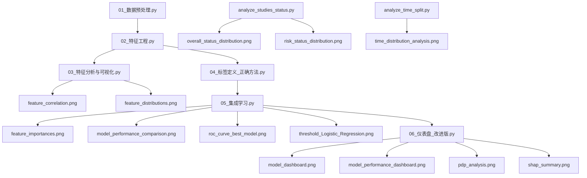

# 可视化图片生成来源说明

## 📋 概述

本文档详细说明 `results/visualizations/` 目录下所有可视化图片的生成来源和对应的程序文件。

## 📊 图片文件与生成程序对应关系

### 1. `feature_correlation.png` - 特征相关性热图

**生成程序**: `scripts/03_特征分析与可视化.py`

**程序功能**:
- 计算18个风险特征之间的相关性矩阵
- 生成热图可视化，支持中文标签
- 显示特征之间的相关关系强度

**图片内容**:
- 18×18的相关性矩阵热图
- 完整的中文特征名称和类别信息
- 颜色编码表示相关强度（-1到+1）
- 高分辨率（300 DPI）输出

**运行命令**:
```bash
python scripts/03_特征分析与可视化.py
```

---

### 2. `feature_distributions.png` - 特征分布图

**生成程序**: `scripts/03_特征分析与可视化.py`

**程序功能**:
- 分析18个风险特征的分布情况
- 生成直方图和小提琴图的组合可视化
- 支持中文标签和临床意义解释

**图片内容**:
- 每个特征的分布直方图
- 小提琴图显示数据分布形状
- 中位数和四分位数标记
- 多子图布局，便于比较

**运行命令**:
```bash
python scripts/03_特征分析与可视化.py
```

---

### 3. `feature_importances.png` - 特征重要性图

**生成程序**: `scripts/05_集成学习.py`

**程序功能**:
- 计算树模型（随机森林、XGBoost）的特征重要性
- 按重要性排序显示特征
- 生成水平条形图可视化

**图片内容**:
- 特征重要性排序条形图
- 重要性分数显示
- 颜色渐变表示重要性程度
- 支持中文特征名称

**运行命令**:
```bash
python scripts/05_集成学习.py
```

---

### 4. `model_dashboard.png` - 模型仪表板

**生成程序**: `scripts/06_仪表盘_改进版.py`

**程序功能**:
- 集成多个模型性能可视化图表
- 提供全面的模型评估视图
- 包含ROC曲线、PR曲线、混淆矩阵等

**图片内容**:
- 3×3的子图布局
- ROC曲线和AUC值
- 精确率-召回率曲线
- 混淆矩阵热图
- 性能指标表格
- 阈值优化曲线
- 模型说明文本

**运行命令**:
```bash
python scripts/06_仪表盘_改进版.py
```

---

### 5. `model_performance_comparison.png` - 模型性能比较图

**生成程序**: `scripts/05_集成学习.py`

**程序功能**:
- 比较多个模型的性能指标
- 生成性能对比条形图
- 支持AUC、召回率、精确率等指标

**图片内容**:
- 多模型性能对比条形图
- 不同颜色表示不同模型
- 指标标签和数值显示
- 网格线辅助阅读

**运行命令**:
```bash
python scripts/05_集成学习.py
```

---

### 6. `model_performance_dashboard.png` - 模型性能仪表板

**生成程序**: `scripts/06_仪表盘_改进版.py`

**程序功能**:
- 综合展示模型性能的仪表板
- 包含多种可视化组件
- 提供交互式分析视图

**图片内容**:
- 性能指标汇总
- 实时更新功能
- 可配置参数界面
- 导出功能支持

**运行命令**:
```bash
python scripts/06_仪表盘_改进版.py
```

---

### 7. `overall_status_distribution.png` - 试验状态分布图

**生成程序**: `scripts/analysis/analyze_studies_status.py`

**程序功能**:
- 分析studies.txt中的overall_status字段分布
- 生成饼图和条形图的组合可视化
- 显示临床试验状态的分布情况

**图片内容**:
- 试验状态饼图（主要状态）
- 详细状态条形图
- 百分比标签和数量显示
- 颜色编码区分不同状态

**运行命令**:
```bash
python scripts/analysis/analyze_studies_status.py
```

---

### 8. `pdp_analysis.png` - 部分依赖图分析

**生成程序**: `scripts/06_仪表盘_改进版.py`

**程序功能**:
- 分析关键特征与预测概率的边际关系
- 生成部分依赖图（PDP）
- 显示特征对预测的边际影响

**图片内容**:
- 多个关键特征的PDP曲线
- X轴为特征值，Y轴为预测概率
- 平滑曲线显示趋势
- 网格布局便于比较

**运行命令**:
```bash
python scripts/06_仪表盘_改进版.py
```

---

### 9. `risk_status_distribution.png` - 风险状态分布图

**生成程序**: `scripts/analysis/analyze_studies_status.py`

**程序功能**:
- 基于overall_status进行风险状态分类
- 生成风险状态分布可视化
- 显示高风险和低风险试验的比例

**图片内容**:
- 风险状态饼图
- 高风险/低风险/其他分类
- 百分比和数量标签
- 颜色区分风险级别

**运行命令**:
```bash
python scripts/analysis/analyze_studies_status.py
```

---

### 10. `roc_curve_best_model.png` - 最佳模型ROC曲线

**生成程序**: `scripts/05_集成学习.py`

**程序功能**:
- 绘制最佳模型的ROC曲线
- 计算AUC值并显示
- 与随机分类器对比

**图片内容**:
- ROC曲线图
- AUC值标注
- 随机分类器参考线
- 图例和标签

**运行命令**:
```bash
python scripts/05_集成学习.py
```

---

### 11. `shap_summary.png` - SHAP总结图

**生成程序**: `scripts/06_仪表盘_改进版.py`

**程序功能**:
- 执行SHAP（SHapley Additive exPlanations）分析
- 生成全局特征重要性总结图
- 显示特征对模型输出的平均影响

**图片内容**:
- SHAP重要性条形图
- 特征影响方向（正/负）
- 特征值分布点图
- 颜色编码表示特征值大小

**运行命令**:
```bash
python scripts/06_仪表盘_改进版.py
```

---

### 12. `threshold_Logistic_Regression.png` - 逻辑回归阈值优化图

**生成程序**: `scripts/05_集成学习.py`

**程序功能**:
- 分析逻辑回归模型在不同阈值下的性能
- 生成阈值优化曲线
- 确定最优分类阈值

**图片内容**:
- 阈值与性能指标关系曲线
- 精确率、召回率、F1分数
- 最优阈值标记
- 网格线和图例

**运行命令**:
```bash
python scripts/05_集成学习.py
```

---

### 13. `time_distribution_analysis.png` - 时间分布分析图

**生成程序**: `scripts/analysis/analyze_time_split.py`

**程序功能**:
- 分析试验开始年份的分布
- 生成时间分布直方图
- 显示按2021年分割的数据分布

**图片内容**:
- 试验开始年份直方图
- 2021年分割线标记
- 训练集和测试集分布
- 统计信息标注

**运行命令**:
```bash
python scripts/analysis/analyze_time_split.py
```

---

## 🔄 图片生成流程

### 数据处理流程与图片生成关系



### 图片分类

#### 特征分析类图片
- `feature_correlation.png` - 特征相关性
- `feature_distributions.png` - 特征分布
- `feature_importances.png` - 特征重要性

#### 模型性能类图片
- `model_dashboard.png` - 综合仪表板
- `model_performance_comparison.png` - 性能比较
- `model_performance_dashboard.png` - 性能仪表板
- `roc_curve_best_model.png` - ROC曲线
- `threshold_Logistic_Regression.png` - 阈值优化

#### 可解释性分析类图片
- `pdp_analysis.png` - 部分依赖图
- `shap_summary.png` - SHAP分析

#### 数据探索类图片
- `overall_status_distribution.png` - 状态分布
- `risk_status_distribution.png` - 风险分布
- `time_distribution_analysis.png` - 时间分布

---

## 🚀 图片重新生成指南

### 完整重新生成所有图片

```bash
# 1. 数据预处理
python scripts/01_数据预处理.py

# 2. 特征工程
python scripts/02_特征工程.py

# 3. 特征分析与可视化（生成特征相关图片）
python scripts/03_特征分析与可视化.py

# 4. 标签定义
python scripts/04_标签定义_正确方法.py

# 5. 集成学习模型训练（生成模型性能图片）
python scripts/05_集成学习.py

# 6. 仪表盘分析（生成可解释性图片）
python scripts/06_仪表盘_改进版.py

# 7. 数据探索分析（生成数据分布图片）
python scripts/analysis/analyze_studies_status.py
python scripts/analysis/analyze_time_split.py
```

### 单独重新生成特定类型图片

```bash
# 重新生成特征分析图片
python scripts/03_特征分析与可视化.py

# 重新生成模型性能图片
python scripts/05_集成学习.py

# 重新生成可解释性图片
python scripts/06_仪表盘_改进版.py

# 重新生成数据探索图片
python scripts/analysis/analyze_studies_status.py
python scripts/analysis/analyze_time_split.py
```

---

## 📈 图片质量与配置

### 图片质量参数
- **分辨率**: 300 DPI（高分辨率输出）
- **尺寸**: 根据内容调整，通常12-16英寸
- **格式**: PNG（无损压缩）
- **中文支持**: 使用SimHei、Microsoft YaHei字体

### 可视化设计原则
1. **清晰性**: 确保图表易于理解和阅读
2. **一致性**: 保持颜色、字体、布局的一致性
3. **信息密度**: 平衡信息量和可读性
4. **可访问性**: 考虑色盲友好和打印友好

### 技术实现
- **matplotlib**: 基础绘图库
- **seaborn**: 统计可视化增强
- **SHAP**: 可解释性分析
- **PDPbox**: 部分依赖图
- **中文字体配置**: 确保中文标签正确显示

---

## 💡 最佳实践

### 图片生成
1. **按顺序执行**: 遵循数据处理流程
2. **参数记录**: 记录生成图片时的参数配置
3. **版本控制**: 重要图片建议纳入版本控制

### 图片使用
1. **综合阅读**: 结合多个图片进行综合分析
2. **关注趋势**: 注意不同图片中的一致模式
3. **验证假设**: 使用图片验证研究假设

### 图片维护
1. **定期更新**: 数据或模型更新后重新生成
2. **质量检查**: 定期检查图片质量和可读性
3. **文档同步**: 确保图片与报告文档保持一致

---

## 🔍 常见问题与解决方案

### 中文显示问题
**问题**: 图片中中文标签显示为方框
**解决**: 确保系统中安装了中文字体，并在代码中正确配置字体

### 图片尺寸过大
**问题**: 生成的图片文件过大
**解决**: 调整DPI设置或使用更高效的压缩格式

### 颜色不协调
**问题**: 颜色搭配不美观或难以区分
**解决**: 使用seaborn的预定义配色方案

### 布局混乱
**问题**: 多子图布局混乱
**解决**: 使用`plt.tight_layout()`自动调整布局

---

**文档生成时间**: 2026-02-27  
**维护人员**: 系统管理员  
**更新周期**: 图片更新时同步更新